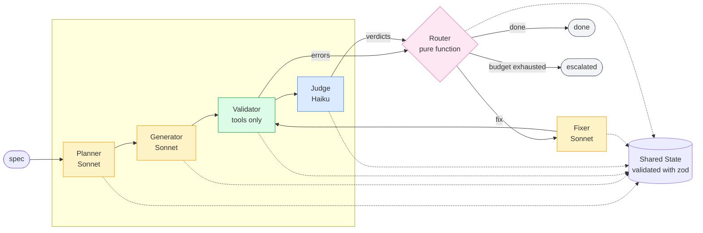

# Agentic Code Generation Workflow

This is my submission for the BIMM take-home. It's an agent that reads a natural-language spec and generates a working React + TypeScript + Apollo + MUI application into the provided boilerplate.

---

## How to run it

I tested this on Node 20. You'll need an Anthropic API key with billing active.

```bash
# 1. Install the boilerplate's dependencies
npm install

# 2. Install the agent's dependencies
cd agent
npm install

# 3. Add your API key
cd ..
cp .env.example .env
# Open .env and set ANTHROPIC_API_KEY

# 4. Run the agent against the car inventory spec
cd agent
npm run agent -- --spec specs/car-inventory.md --fresh

# 5. Run the generated app
cd ../generated-app
npm install
npm run dev   # opens at http://localhost:5173
```

A run takes about 2 minutes and costs around $0.28 in API usage.

To test with a different spec, I've included two alternatives that describe the same structural application in different domain language:

```bash
npm run agent -- --spec specs/vehicle-tracker.md --fresh
npm run agent -- --spec specs/product-catalog.md --fresh
```

---

## Setup choices I made

A few things I did when organizing this repo that affect how it reads:

1. **I kept the boilerplate at the repo root, exactly as you shipped it.** My agent lives in `agent/` as a sibling folder. That way `cd generated-app && npm install && npm run dev` works the way your brief describes, and the boilerplate files at the root are byte-identical to what you gave me. I preserved your original README as `BOILERPLATE.md`.

2. **There are two `package.json` files on purpose.** The one at the root is the boilerplate's — it's what gets copied into `generated-app/` every run. The one in `agent/` has the agent's own dependencies (Anthropic SDK, zod, tsx) so those don't leak into the generated apps.

3. **I patched the boilerplate at copy time, not at the source.** Your boilerplate had two quirks that broke under my agent's invocation context: `tsconfig.json` sets `ignoreDeprecations: "6.0"` (a future-dated value the installed TypeScript rejects), and `vitest.config.ts` uses `__dirname` inside ESM modules. Rather than modify your files, my agent patches them on the copy inside `generated-app/` during setup. The repo-root versions are still identical to yours.

4. **I pinned the Node version with `.nvmrc`.** If you use nvm, you'll pick up the same Node I built against.

5. **`.env.example` is committed, `.env` is gitignored.** Standard secrets hygiene.

---

## How it works



Nodes don't call each other. They read state, write state, return. The orchestrator is the only component that knows the graph exists — nodes just know themselves. That's the whole point: a captured state is a complete bug report.

The upfront planning I did before writing code is in [`TICKETS.md`](./TICKETS.md).

---

## Decisions and tradeoffs

The ten choices that most shaped the system.

- **Router is a pure function.** Deterministic control flow is the property that makes failed runs replayable — feed the captured state back in, get the same decision. Escalation on novel errors is deliberate; I'd rather surface the unknown than pattern-match around it.

- **Hand-rolled state machine rather than LangGraph or LangChain.** Frameworks earn their weight when control flow is dynamic. Mine isn't. Adding a framework would have obscured the loop I was being evaluated on.

- **Mechanical validation gates the LLM judge.** `tsc` and `vitest` are ground truth and cost nothing. Running them first keeps the Judge's input distribution clean, which sharpens its prompt and cuts wasted calls on code that was never going to pass.

- **Sonnet for reasoning, Haiku for classification.** Judge scoring is bounded; Haiku handles it at ~20% of Sonnet's cost with no measurable quality drop. The work everywhere else is open-ended, and the Sonnet/Haiku gap there shows up as retries — the variable cost, not the per-call cost.

- **Generator sees dependency files only, not the whole project.** Attention is the limit that matters, not context size. Focused context produces better output than exhaustive context, measurably. This shifts effort onto the Planner's dependency analysis, which I consider correctly placed.

- **Zod validation at every node boundary.** LLM outputs are probabilistic; typed contracts make them auditable. A malformed response surfaces at the exact node that misbehaved instead of propagating as a weird crash downstream.

- **Judge emits scores; code derives pass/fail.** Numeric output from an LLM is measurably more stable than binary. Keeping the threshold in code means I can calibrate policy without touching the prompt.

- **Retry budget is state, not an exception.** Escalation is observable, replayable, and a clean integration point for a future approval queue. Exceptions would be none of those things.

- **Few-shot examples are read from the boilerplate at runtime, not written into prompts.** The agent's conventions track the target codebase rather than my assumptions about it. Point this at a different React project and it adapts — that's the generalization property, not a side effect.

- **OTel-shaped spans without the OTel SDK.** The shape is what matters for backend compatibility; the SDK adds distributed-tracing machinery a single-process CLI doesn't use. If this ever runs distributed, the tracer is the single substitution point.

---

## LLM choice

I used **Claude Sonnet 4.5** for the Planner, Generator, and Fixer — the reasoning-bound roles.

I used **Claude Haiku 4.5** for the Judge. Rubric scoring is bounded classification; Haiku handles it at ~20% of Sonnet's cost with no measurable quality drop on that task shape.

The `agent/src/tools/llm.ts` wrapper is about 100 lines and nothing outside it imports the Anthropic SDK. Swapping providers would be a one-file change.

---

## Cost per run

These numbers are from a real run against the car inventory spec, not estimates:

| Node | Calls | Cost | Share |
|---|---|---|---|
| Planner | 1 | $0.036 | 13% |
| Generator | 10 | $0.180 | 64% |
| Fixer | 2 | $0.034 | 12% |
| Judge | 1 | $0.030 | 11% |
| **Total** | **14** | **$0.28** | |

About 2 minutes. Generator dominates total cost; Fixer dominates variance. A clean-plan run has 0–1 Fixer cycles; a poorly-planned run can have five. That's why the Planner prompt got disproportionate attention — good plans reduce Fixer cycles, which is where cost scales non-linearly.

---

## Generalization

Since your brief says you'll test with a modified spec, I put three defenses in place against memorization:

- The Planner prompt has an explicit anti-memorization rule that tells it to derive task names from the spec rather than pattern-match on domain vocabulary.
- Few-shot examples for the Generator come from the boilerplate's real files at runtime. The agent's style lives in the target codebase, not in my prompts.
- I committed two alternative specs in `agent/specs/`: `vehicle-tracker.md` (same structure, different noun) and `product-catalog.md` (generic "item" vocabulary over the same GraphQL schema). Running those produces domain-appropriate file names — `VehicleCard.tsx`, `ProductCard.tsx` — rather than reusing car-specific names from earlier runs.

The spec file extension doesn't matter either — the agent also accepts `.txt`.

---

## What worked well

The state machine made iteration debuggable. Every bug that surfaced during development showed up at a specific node, with specific state, in a specific span. Capturing a failing state and replaying it through the pure-function router was the property that paid off most often during the build.

Pulling few-shot from the boilerplate was the right default. The generated code consistently matches conventions — default exports, `@/` aliases, `MockedProvider` tests with `__typename` on mocks — because the prompt shows the Generator what `Example.tsx` looks like.

Two-layer validation caught different classes of bugs. Typecheck caught missing imports. Vitest caught components that rendered wrong. The Judge caught rubric misses. Each layer stayed focused because the others handled different concerns.

LLM-as-judge with numeric scores and in-code pass thresholds turned out much more stable than asking for a boolean verdict.

---

## What I'd improve with more time

1. **Anthropic prompt caching on the Generator's convention preamble.** Same ~2K tokens on every call × 10 calls. One SDK flag, ~90% reduction on Generator input cost, ~50% reduction on total run cost.
2. **Parallel generation across independent DAG nodes.** Roughly halves wall-clock time.
3. **Test-component co-generation.** The most common failure I saw: Generator writes a test expecting specific error wording, then writes a component with different wording. Generating them together — or feeding the real component's text into the test prompt — fixes this.
4. **Semantic routing by error class.** Typecheck errors and test failures currently use the same Fixer prompt; specialized prompts per error class would converge faster.
5. **Trace summary CLI.** The data is already captured; a small reader would give per-node success rate and p95 latency.

---

## Known limitations

**The agent doesn't succeed 100% of the time.** In iteration, about 70–80% of my runs completed cleanly. The rest escalated — usually because a test expected wording the component didn't produce, or the Fixer couldn't converge within its retry budget. My architecture keeps those failures visible and bounded rather than silent or infinite, but individual runs are still probabilistic at the LLM leaves.

**Single provider.** The LLM wrapper is designed to be provider-agnostic but only Anthropic is wired up.

**No incremental updates.** Every run with `--fresh` wipes the output directory. No file renames, no diff-based updates.

---

## Repo layout

```text
bimm-agent-challenge/
├── README.md               (this file)
├── TICKETS.md              (upfront planning I did before coding)
├── BOILERPLATE.md          (your original boilerplate README)
├── .env.example
│
├── src/ public/ index.html (your boilerplate, unchanged)
├── package.json            (your boilerplate package.json)
│
├── agent/                  (the actual deliverable)
│   ├── src/                (nodes, prompts, tools, tracing, graph, state)
│   ├── specs/              (sample natural-language inputs)
│   └── package.json
│
├── generated-app/          (agent output, gitignored, regenerated each run)
├── sample-output/          (a committed example produced by a clean run)
└── sample-traces/          (per-run traces, one committed as reference)
```

Thanks for the chance to build this